# 无人值守linux安装

## 实验环境

* Virtualbox
* Ubuntu 18.04 Server 64bit
* Windows10

## 实验步骤

### 一、配置虚拟机网卡

1. 手工为虚拟机clone-ubuntu添加一块host-only网卡，方便后续ssh登陆

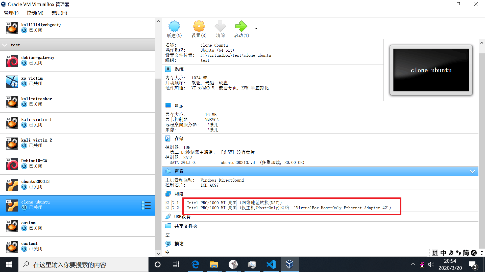
2. 打开虚拟机，输入命令```sudo vim /etc/netplan/01-netcfg.yaml ```打开网卡配置文件，在文件最后添加如下内容：

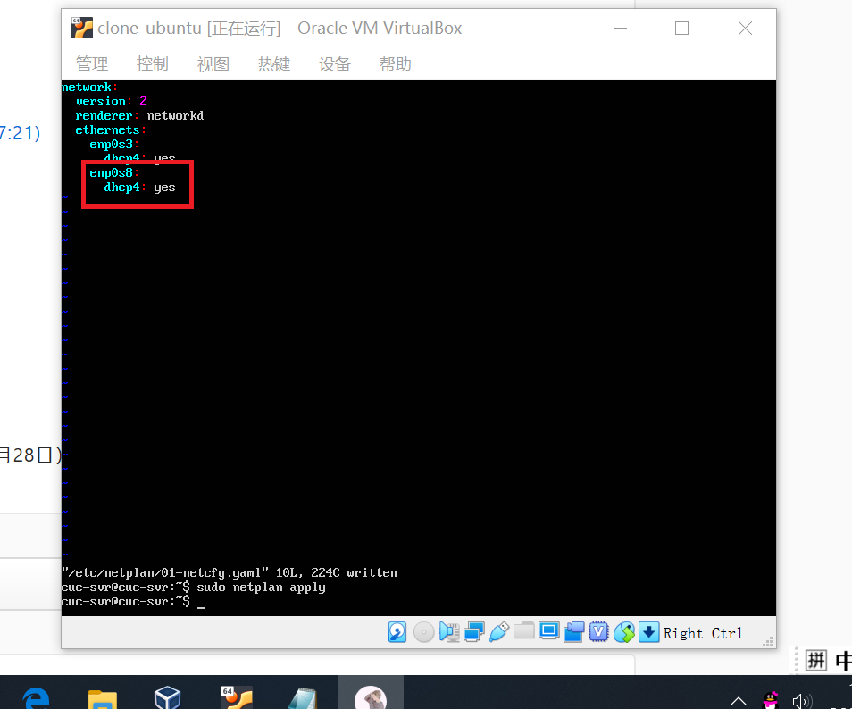
3. 输入命令```sudo netplan apply```使修改后的配置生效。此时输入ifconfig，可以看到两块网卡信息。

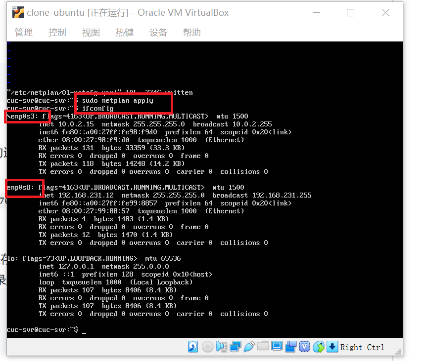

### 二、iso镜像生成

* 在当前用户目录下

1. 在当前用户目录下创建一个用于挂载iso镜像文件的目录
```bash
mkdir loopdir
```

2. 直接在虚拟机中下载原ubuntu-16.04.1-server-amd64.iso

```bash
wget http://mirrors.ustc.edu.cn/ubuntu-cdimage/releases/18.04/release/ubuntu-18.04.4-server-amd64.iso
```
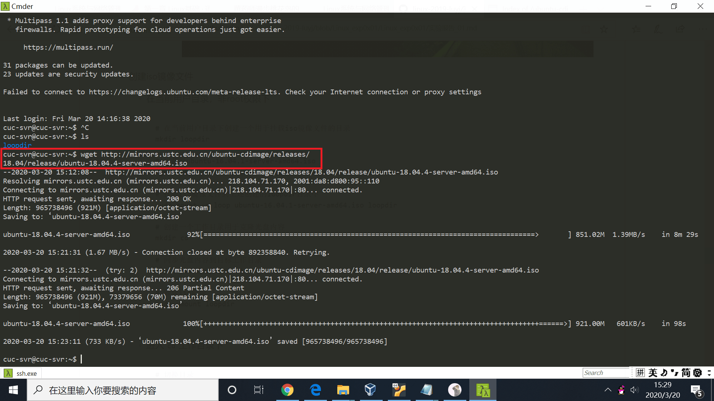

3. 挂载iso镜像文件到上述创建的loopdir目录中
```bash
sudo mount -o loop ubuntu-16.04.1-server-amd64.iso loopdir
```
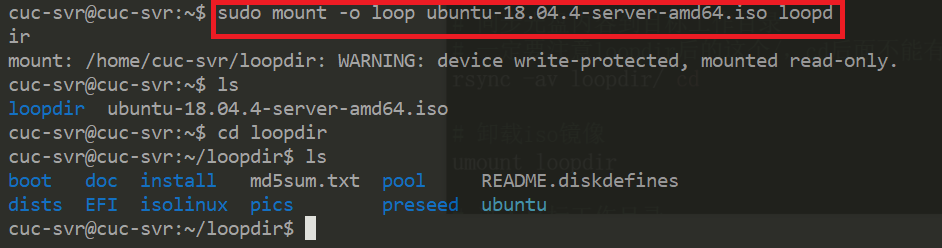

4. 创建一个工作目录用于克隆光盘内容
```bash
mkdir cd
```

5. 同步光盘内容到目标工作目录
```bash
rsync -av loopdir/ cd
```
6. 卸载iso镜像
```bash
sudo umount loopdir
```
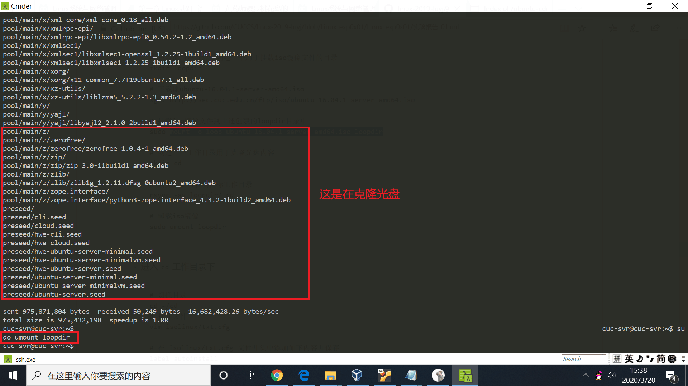

* 切换至cd工作目录下

```bash
# 切换目录
cd ~/cd
# 打开文件
vim isolinux/txt.cfg

# 在 isolinux/txt.cfg 文件开头中添加如下内容并保存
label autoinstall
menu label ^Auto Install Ubuntu Server
kernel /install/vmlinuz
append  file=/cdrom/preseed/ubuntu-server-autoinstall.seed debian-installer/locale=en_US console-setup/layoutcode=us keyboard-configuration/layoutcode=us console-setup/ask_detect=false localechooser/translation/warn-light=true localechooser/translation/warn-severe=true initrd=/install/initrd.gz root=/dev/ram rw quiet
```
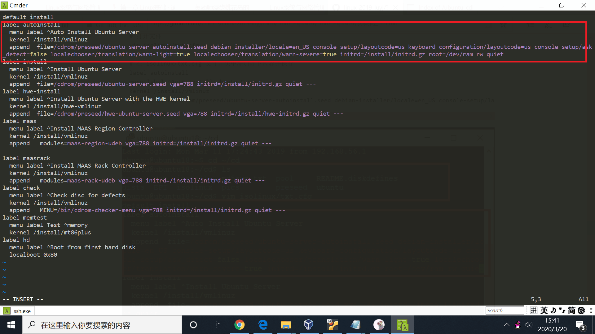

1. 将老师在课件中提供的seed文件下载至本机，并且用scp命令拷贝到虚拟机中cd目录下的preseed文件夹中。

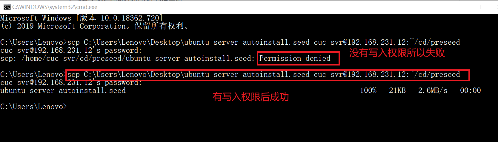

* 一开始拷贝报错，是因为目标路径没有写入权限，我们利用命令```sudo chmod -R 775 ~/cd/preseed```修改权限后，拷贝成功。

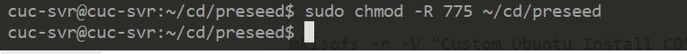

2. 修改文件isolinux/isolinux.cfg,在文件末尾添加timeout 10

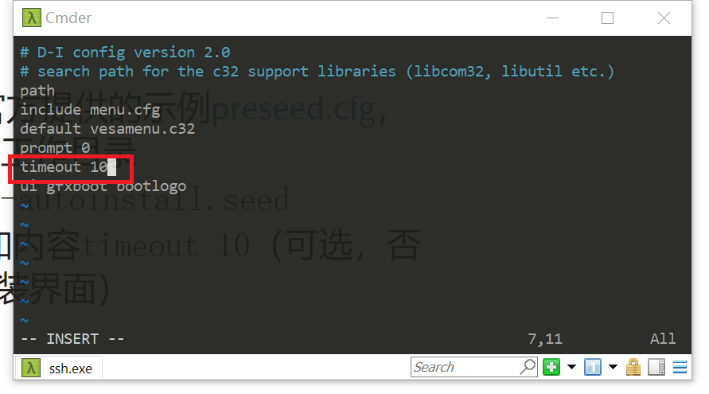

3. 重新生成md5sum.txt

```bash
find . -type f -print0 | xargs -0 md5sum > md5sum.txt
```

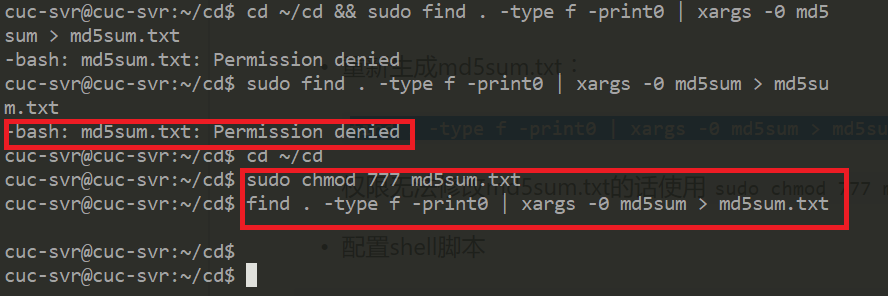
* 同样一开始会报错，我们利用命令```suso chmod 777 md5sum.txt```修改权限后成功。

3. 配置shell脚本。我们新建一个shell文件，并在其中写入以下内容

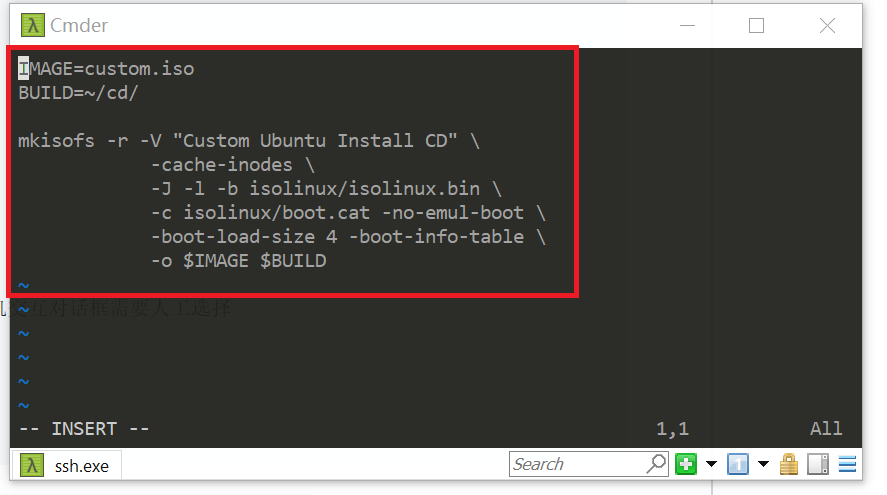
4. 执行shell命令发现报错，我们先要安装需要的包

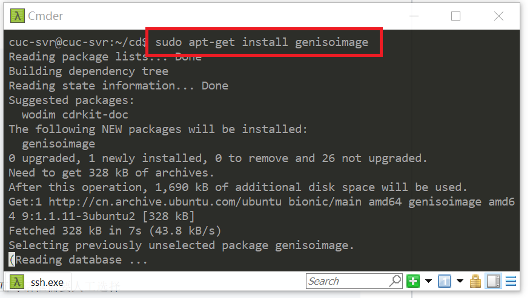

5. 输入命令```sudo bash shell```执行脚本，会生成镜像custom.iso，这就是我们定制好的镜像了。为了后续安装，我们将生成的镜像拷贝到宿主机上。

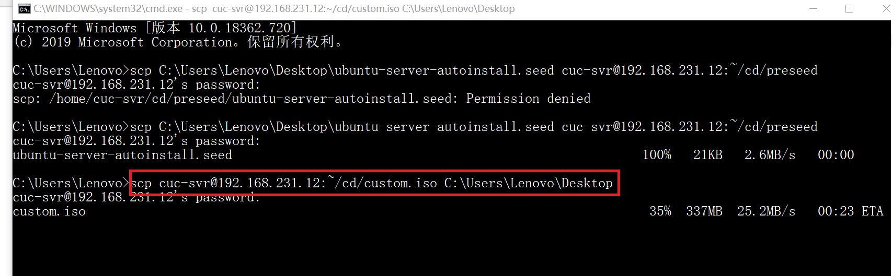
* 这里执行一开始一直失败，怎么修改都一直报错，最后发现自己的错误居然是shell脚本中第一个单词IMAGE中的I不小心被删除了。以后写完文件还是用cat命令显示确认一下。
* 至此，我们的定制镜像的过程就完成了。

### 三、利用生成的镜像进行无人值守的Linux安装

* 打开老师提供的seed文件，可以看到用户名为cuc，密码为sec.cuc.edu.cn，这让我们能够成功登陆安装后的ubuntun系统。
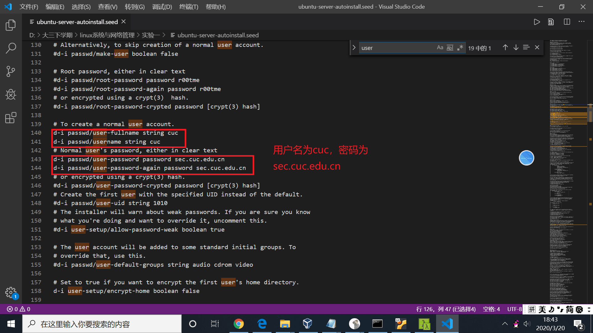
* [无人值守安装结果录屏](https://www.bilibili.com/video/av97977428?from=search&seid=16745732964795201591)

## 参考文献

* [出现Permission denied的解决办法](https://blog.csdn.net/qq_16525279/article/details/80245350)
* [无人值守安装ISO制作过程示例](https://c4pr1c3.github.io/LinuxSysAdmin/chap0x01.exp.md.html#/iso)