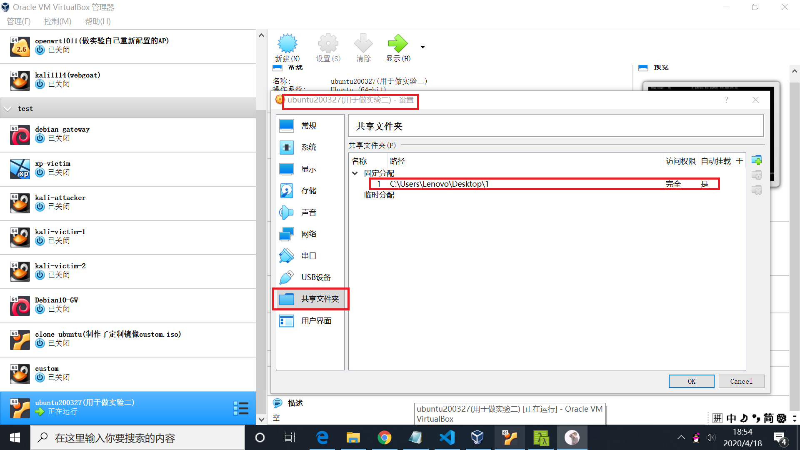
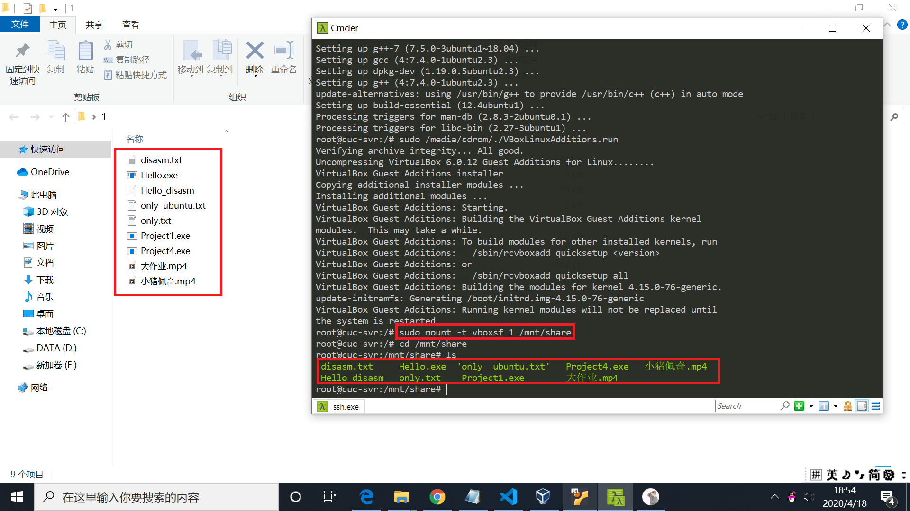

# 实验三 Systemd入门

## 实验要求

* [Systemd 入门教程：命令篇](http://www.ruanyifeng.com/blog/2016/03/systemd-tutorial-commands.html)
* [Systemd 入门教程：实战篇](http://www.ruanyifeng.com/blog/2016/03/systemd-tutorial-part-two.html)
* 参照第2章作业的要求，完整实验操作过程通过asciinema进行录像并上传，文档通过github上传

## 实验环境

* Ubuntu 18.04 Server 64bit

## 实验过程

* [系统管理](https://asciinema.org/a/321237)

  * 遇到的问题，设置时间时报错:Failed to set time: Automatic time synchronization is enabled。
  * 解决方案：先输入命令```timedatectl set-ntp no``` ，再修改时间就可以成功
* [Unit](https://asciinema.org/a/321242)

* [Unit的配置文件](https://asciinema.org/a/321245)

* [Target](https://asciinema.org/a/321248)

* [日志管理](https://asciinema.org/a/321262)

* [实战篇](https://asciinema.org/a/321293)

## 自查清单

1. 如何添加一个用户并使其具备sudo执行程序的权限？
```bash
sudo adduser newuser
sudo usermod -G sudo newuser
```
2. 如何将一个用户添加到一个用户组？
```bash
sudo usermod -G usergroup username
#usergroup用户组名，username用户名
```
3. 如何查看当前系统的分区表和文件系统详细信息？
```bash
sudo fdisk -l
cat /etc/fstab
```
4. 如何实现开机自动挂载Virtualbox的共享目录分区？
* 在Virtual box界面，设置->共享文件夹，选定宿主机上的共享文件夹路径，这里我们选择的是桌面上的文件夹1



* 安装增强功能
```bash
sudo apt-get update
sudo apt-get install build-essential linux-headers-$(uname -r)
sudo /media/cdrom/./VBoxLinuxAdditions.run
```
* 重启虚拟机：reboot
* 进入/mnt： cd /mnt
* 创建共享目录：mkdir share
* 挂载共享目录：sudo mount -t vboxsf 1 /mnt/share



可以看到，/mnt/share下的文件和宿主机中桌面上文件夹1中的文件相同，共享文件夹设置成功。

5. 基于LVM（逻辑分卷管理）的分区如何实现动态扩容和缩减容量？
```bash

sudo lvextend -L +5g foo/bar	# 给卷组foo中的逻辑卷bar增加5g的空间
sudo lvextend -L -5g foo/bar	# 给卷组foo中的逻辑卷bar减少5g的空间
```

6. 如何通过systemd设置实现在网络连通时运行一个指定脚本，在网络断开时运行另一个脚本？

* 修改NetworkManager.service配置文件的service区块，修改ExecStartPost及ExecStopPost字段，分别改为对应配置文件的路径及名称

7. 如何通过systemd设置实现一个脚本在任何情况下被杀死之后会立即重新启动？实现杀不死？

* 将该脚本的配置文件中的service区块的restart字段值设置为always

## 参考文献

* [centos7修改服务器时间报错](https://blog.csdn.net/xzm5708796/article/details/103733211)
* [LVM的配置](https://blog.csdn.net/u011603499/article/details/52574106)
* [VirtualBox创建Windows与Ubuntu的共享文件夹](https://blog.csdn.net/z191726501/article/details/78484767)